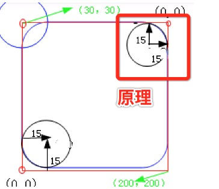
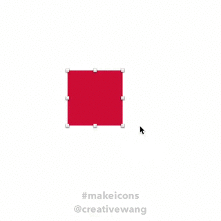
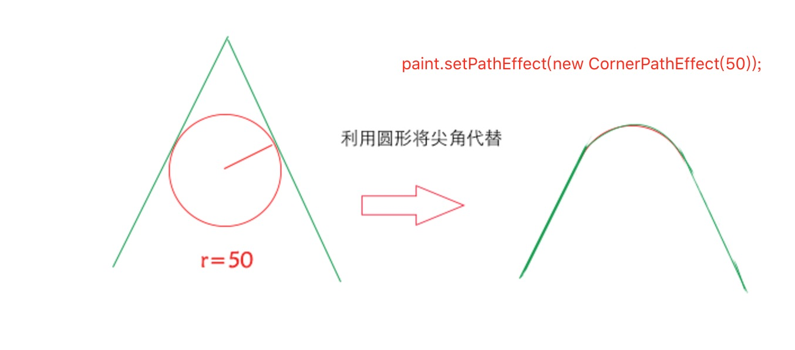

**圆角矩形**

**心的制作**

**Path 's CornerPathEffect原理**

[来源:harvic 's blog](http://blog.csdn.net/harvic880925/article/details/51010839)

**手绘lineTo的优化技巧)**
>仅仅扩充思维即可  不如直接用CornerPathEffect来的实在;

[来源:harvic 's blog](http://blog.csdn.net/harvic880925/article/details/50995587)